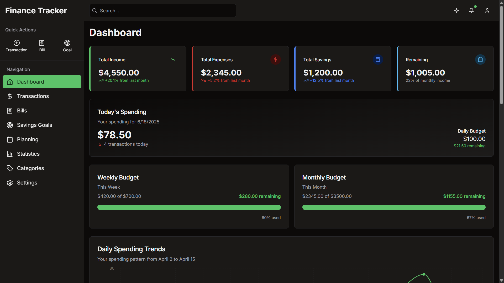

# 💸 Budget Buddy - Backend

This is the backend API for **Budget Buddy**, a fullstack budgeting and expense tracking app. Built with **NestJS**, powered by **PostgreSQL** and **Prisma ORM**, and containerized with **Docker** for easy development and deployment.

---

## ✨ Technologies

- **NestJS** – Scalable Node.js framework with TypeScript
- **PostgreSQL** – Relational database for structured data
- **Prisma ORM** – Type-safe database client for PostgreSQL
- **Docker** – Containerization for consistent environment setup
- **JWT** – Secure user authentication
- **bcrypt** – Password hashing
- **Class Validator / Class Transformer** – For input validation
- **ConfigModule** – Environment configuration management

---

## 🚀 Features

- 🔐 User registration & login with hashed passwords
- 📦 CRUD operations for budgets and expenses
- 💸 Monthly budget tracking and spending history
- 🧮 Data modeling with Prisma schema
- 🧰 RESTful API endpoints
- 🐳 Dockerized development environment

---

## 📍 The Process

The backend for Budget Buddy was built with scalability and maintainability in mind. I chose **NestJS** for its strong structure and TypeScript support, and **Prisma** to manage PostgreSQL interactions with clean, declarative data modeling.

Using **Docker** ensures that the app runs consistently across different environments. This backend is built to work seamlessly with the Budget Buddy frontend, providing reliable APIs for managing users, budgets, and transactions.

This project demonstrates my ability to architect backend systems using modern tools and best practices.

---

## 🚦 Running the Project

1. Clone the repository
2. Install dependencies: npm install
3. Create a .env file
- DATABASE_URL=postgresql://user:password@db:5432/budgetbuddy
- JWT_SECRET=your_jwt_secret
4. Start the local databasebase 
- docker compose up -d
5. Run database migrations
- npx prisma generate
- npx prisma migrate dev
3. Run development server: npm run start:dev
4. Open http://localhost:3000/#api in your browser to turn on Swagger

---

## 🎞️ Preview

